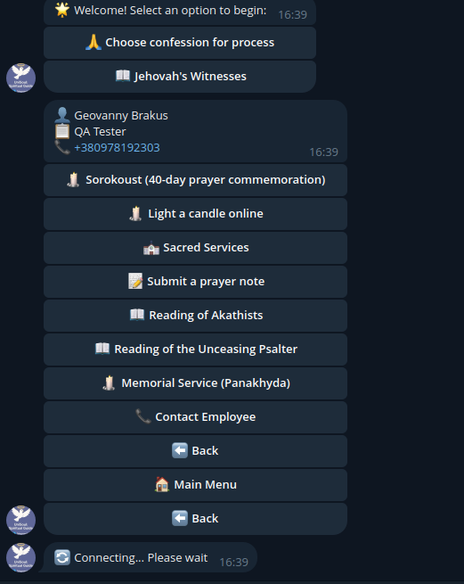
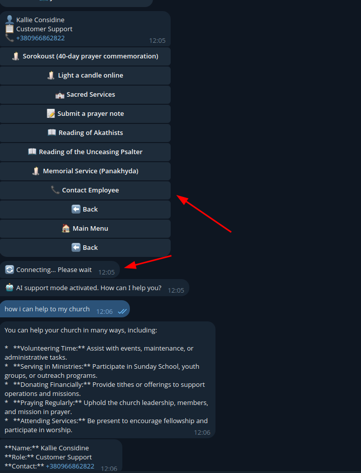
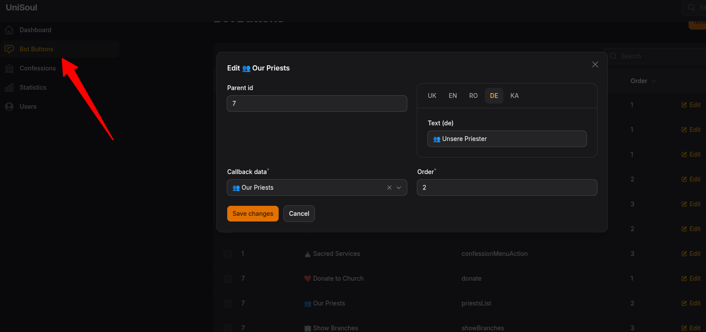
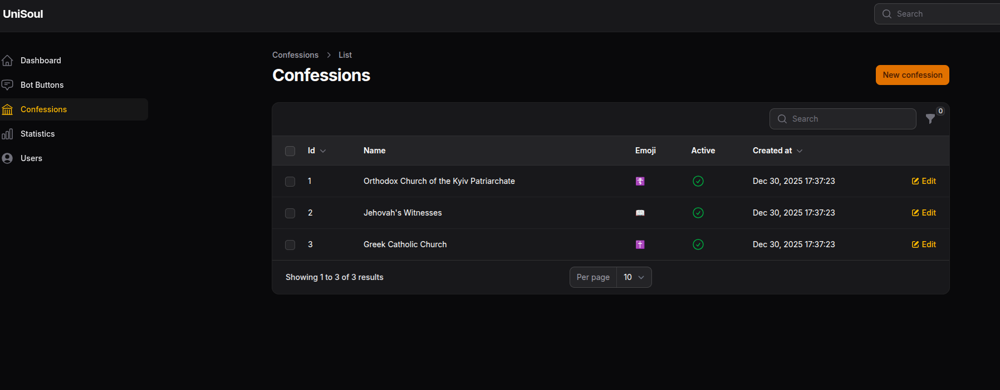

# 🕊️ UniSoul — Spiritual Guide Telegram Bot


**UniSoul** is a modern Telegram bot built with **Laravel 12** and **PHP 8.2**, designed as a spiritual guide with confession flows, configuration menus, and an admin panel powered by **Filament**.

> ⚠️ Project status: **Testing / Demo-ready**

---

## 🎥 Demo Videos

- **Bot Demo (User Flow):**  
  https://youtu.be/zdwysA-RAVQ

- **Admin Panel & Management Demo:**  
  https://youtu.be/hal26y43olA

---

## ✨ Features

- Telegram bot with structured conversational flows
- User configuration (language, notifications, gender, etc.)
- Confession and message storage
- Filament admin panel for moderation and statistics
- Docker-first setup with Laravel Sail
- Prepared for polling **and** webhook modes
- Laravel 12 & PHP 8.2 compatible architecture

---

## 🧱 Tech Stack

- **Backend:** Laravel 12, PHP 8.2
- **Bot Framework:** Nutgram
- **Admin Panel:** Filament
- **Database:** MySQL
- **Infrastructure:** Docker, Laravel Sail
- **Cache / Queue Ready:** Redis (optional)

---

## 📸 Screenshots

### 🤖 Bot Interface

| Confession Actions | Contact & Chat Form |
|-------------------|---------------------|
|  |  |
| Main menu and confession flow | User contact and chat interaction |

---

### 🛠️ Admin Panel (Filament)

| Bot Buttons Management | Confessions Management |
|-----------------------|------------------------|
|  |  |
| Configure bot keyboards and actions | Moderate and review user confessions |

---

## 🚀 Installation & Setup

### Requirements

- Docker
- Docker Compose

---

### 1. Environment Configuration

Copy `.env.example` to `.env` and configure:

```env
APP_ENV=local
TELEGRAM_BOT_TOKEN=YOUR_BOT_TOKEN

DB_CONNECTION=mysql
DB_HOST=mysql
DB_PORT=3306
DB_DATABASE=laravel
DB_USERNAME=sail
DB_PASSWORD=password
````

---

### 2. First Run (Docker)

```bash
docker compose up -d
docker compose exec laravel.test composer install
docker compose exec laravel.test php artisan migrate
```

---

### 3. Daily Usage (Sail)

```bash
./vendor/bin/sail up -d
./vendor/bin/sail down
```

---

## 🤖 Bot Execution Modes

### Polling Mode (Default — Dev & Prod)

Configured via `supervisord`:

* `docker/8.4/supervisord.conf` (local)
* `docker/production/supervisord.conf` (production)

Run manually if needed:

```bash
./vendor/bin/sail artisan nutgram:run
```

---

### Webhook Mode (Optional)

Prepared but **disabled by default**.

Enable webhook after deployment:

```bash
php artisan nutgram:hook:set https://yourdomain.com/api/telegram/webhook
```

Check status:

```bash
php artisan nutgram:hook:info
```

Remove webhook:

```bash
php artisan nutgram:hook:remove
```

Webhook endpoint:

```
POST /api/telegram/webhook
```

(CSRF excluded)

---

## 🧪 Testing

```bash
./vendor/bin/sail artisan test
```

Includes feature tests for webhook handling and database persistence.

---

## 🛠️ Admin Panel (Filament)

**URL:**
[http://localhost:8050/management](http://localhost:8050/management)

### Default Admin Users (Seeded)

| Email                                           | Password |
| ----------------------------------------------- | -------- |
| [default@admin.test](mailto:default@admin.test) | password |
| [test@admin.test](mailto:test@admin.test)       | password |

Resources:

* Users
* Confessions
* Bot Buttons
* Statistics

Create new admin:

```bash
./vendor/bin/sail artisan make:filament-user
```

---

## 🔄 Core Bot Flows

| Action               | Behavior          | Persistence              |
| -------------------- | ----------------- | ------------------------ |
| `/start`             | Show main menu    | UserConfig + UserMessage |
| Ask Question         | Prompt input      | UserMessage              |
| My Config            | Show settings     | UserConfig               |
| Free text            | Acknowledgement   | UserMessage              |
| Change language      | Update preference | UserConfig               |
| Toggle notifications | Update flag       | UserConfig               |

Logic is centralized in:

```
app/Services/TelegramBotService.php
```

---

## 🧩 Laravel 12 Compatibility Fixes

* Updated middleware signatures
* Modern `Http\Kernel.php`
* Webhook route using controller array syntax
* CSRF exclusion for Telegram webhook
* Strong typing for PHP 8.2
* Service-based bot architecture

---

## 📄 License

MIT License

---

## 📬 Contact

This project is suitable as:

* Portfolio demo
* SaaS Telegram bot base
* Client-ready bot foundation

For customization or integration — open an issue or contact the author.
